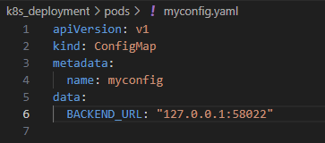

# Challenge Project

## Overview

This project uses a Cassandra database with a 2-node cluster for efficient scalability. The backend, powered by Scala and Akka HTTP, ensures high performance. React and Material UI are employed for a sleek and intuitive frontend interface.

### Key Features

- **Secure Authentication**: Features robust login and signup processes using JWT tokens, providing a secure and reliable authentication system.
- **Advanced Data Grid**: Offers a sophisticated data grid with extensive column filtering capabilities. Backend logic handles row filtering and pagination, ensuring a smooth and efficient user experience.
- **Dynamic Time Series Visualization**: Allows users to visualize time series data through a variety of chart types. Includes features for selecting specific data ranges, enabling detailed analysis of data trends and patterns.
- **Automated Data Management**: Leverages Apache Spark for the automation of database creation and data loading.

## How to Reproduce

### Prerequisites

Before you start, ensure you have Docker installed on your local machine. This project utilizes Docker Compose for simplifying the setup and deployment process.

### Running the Application

1. Clone this repository to your local machine.
2. Navigate to the main folder of the project.

#### Running the Application with Docker-compose

3. Run the following command:

```bash
docker-compose up
```

This command starts all the necessary services and applications in containers. The process may take some time during the first run as images are being pulled and containers are being set up.

4. Once the application is successfully started, you should see a log message stating:

```bash
Application is running go to http://localhost:3000/
```

indicating that the backend is up and running, and the application can be accessed through your web browser.


### Running the Application with kubernates
#### If you are Using Minikube:
1-Run Minkube:
```bash
minikube start
```
2-Deploy The Backend And Cassandra pods:
```bash
kubectl apply -f .\k8s_deployment\pods\deployment-cassandra.yaml 
kubectl apply -f .\k8s_deployment\pods\deployment-back.yaml 
```
3-Get the Backend url assigned by minikube:
```bash
minikube service back-service --url
```
Keep this command prompt open and open another one.

4-Set the URL of the backend in the configmap at.\k8s_deployment\pods\myconfig.yaml:



5-Deploy The frontend and the configmap : 
```bash
kubectl apply -f .\k8s_deployment\pods\myconfig.yaml 
kubectl apply -f .\k8s_deployment\pods\deployment-front.yaml 
```
6- Once the pods are ready and the Backend finished uploading the data to Cassandra,access the frontend pod (my take 10-15 minutes depending on your internet connection) : 

```bash
 kubectl  port-forward svc/front-service 3000:3000
```
Now the App is running on: http://127.0.0.1:3000/

#### If you are using minikube:
1-Create Cluster a 2 Worker Node cluster:
```bash
kind create cluster --config .\k8s_deployment\kind\kind-config.yaml
```
2-Deploy all the pods:
```bash
kubectl apply -f .\k8s_deployment\pods\deployment-cassandra.yaml 
kubectl apply -f .\k8s_deployment\pods\deployment-back.yaml
kubectl apply -f .\k8s_deployment\pods\myconfig.yaml 
kubectl apply -f .\k8s_deployment\pods\deployment-front.yaml 
```
3- In 2 different command prompt, Run run each one of these commmands(Once the pods are ready and the Backend finished uploading the data to Cassandra):
```bash
 kubectl  port-forward svc/front-service 3000:3000
 kubectl  port-forward svc/front-service 8080:8080
```
Now the App is running on: http://127.0.0.1:3000/
